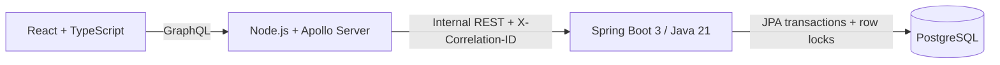

# Mini Payment Ledger & Invoice Service

A production-minded Accounts Payable module for a Transportation Management System. It demonstrates immutable double-entry accounting, derived balances, invoice lifecycle management, idempotent payment webhooks, and concurrency-safe settlement through a polished finance operations UI.

Live Frontend: https://amitkumrsingh-mini-ledger.onrender.com  
GraphQL Endpoint: https://amitkumrsingh-mini-ledger-graphql.onrender.com/graphql  
GraphQL Playground/Sandbox: https://amitkumrsingh-mini-ledger-graphql.onrender.com/graphql  
Spring Boot Health Endpoint: https://amitkumrsingh-mini-ledger-payment.onrender.com/actuator/health  
GitHub Repository: https://github.com/Amitkumrsingh/mini-payment-ledger  

## Architecture



- **React** owns presentation, forms, accessible feedback, and deterministic dollar-string conversion.
- **Apollo BFF** owns the public contract, Zod boundary validation, correlation IDs, and safe error mapping.
- **Spring Boot** is the only source of financial truth. It owns validation, state changes, idempotency, locking, and atomic persistence.
- **PostgreSQL** provides constraints, immutable journal history, unique payment IDs, and `SELECT … FOR UPDATE` semantics through JPA.

Money is stored in integer cents (`BIGINT`/Java `long`) and exposed through a GraphQL `Long` scalar serialized as a decimal string. Account balances are never mutable columns: assets and expenses calculate debit minus credit, while liabilities, revenue, and equity calculate credit minus debit. Every journal transaction is validated to have at least two positive, same-currency entries with equal debit and credit totals.

Payment idempotency uses both an application lookup and a unique `external_payment_id` database constraint. An identical replay returns the original payment. Reusing an ID for another invoice, amount, or currency returns `IDEMPOTENCY_CONFLICT`. Payment processing locks the invoice row, recalculates successful payments inside the transaction, validates outstanding funds, and writes the payment plus AP debit/Cash credit ledger transaction before commit. This prevents two concurrent payments from overpaying the same invoice.

## Run locally with Docker

Requirements: Docker Desktop with Compose v2+.

```bash
git clone https://github.com/Amitkumrsingh/mini-payment-ledger.git
cd mini-payment-ledger
cp .env.example .env
docker compose up --build
```

Open:

- Frontend: http://localhost:5173
- GraphQL Sandbox: http://localhost:4000/graphql
- GraphQL health: http://localhost:4000/health
- Spring health: http://localhost:8080/actuator/health

Reset all development data with `docker compose down -v`. Set `SEED_DATA_ENABLED=false` in `.env` to disable sample invoices. The AP and Cash system accounts are schema reference data and are always installed by Flyway.

## Manual development

Start PostgreSQL and create a `payment_ledger` database, then export the values from `.env.example` using `localhost` service URLs.

```bash
# Spring Boot, Java 21
cd payment-service
./mvnw spring-boot:run

# GraphQL API, Node 22+
cd graphql-api
npm ci
npm run dev

# React/Vite, Node 22+
cd frontend
npm ci
npm run dev
```

Flyway is the complete schema authority; Hibernate uses `ddl-auto=validate` and never creates production tables.

## Tests and builds

```bash
cd payment-service && ./mvnw verify
cd graphql-api && npm ci && npm run lint && npm test && npm run build
cd frontend && npm ci && npm run lint && npm test && npm run build
```

Spring integration tests use Testcontainers with PostgreSQL—not H2—including a synchronized two-request overpayment test. Docker must be available for those tests.

## GraphQL API examples

Create an account:

```graphql
mutation {
  createAccount(input: {code: "FUEL-001", name: "Fuel Expense", type: EXPENSE, currency: USD}) {
    id code name type
  }
}
```

Create and send a $120 invoice:

```graphql
mutation CreateInvoice {
  createInvoice(input: {
    invoiceNumber: "INV-1001", vendorName: "ABC Transport Services",
    vendorReference: "VENDOR-123", currency: USD,
    issueDate: "2026-07-10", dueDate: "2026-07-20",
    lineItems: [
      {description: "Freight service", quantity: 2, unitPriceInCents: "5000"},
      {description: "Loading charge", quantity: 1, unitPriceInCents: "2000"}
    ]
  }) { id invoiceNumber subtotalInCents outstandingAmountInCents status }
}

mutation SendInvoice($id: ID!) {
  sendInvoice(invoiceId: $id) { id status }
}
```

Apply a partial payment, retry it unchanged, then use a new ID for the final payment:

```graphql
mutation Pay($invoiceId: ID!, $externalId: String!, $amount: Long!) {
  applyPayment(input: {
    externalPaymentId: $externalId, invoiceId: $invoiceId,
    amountInCents: $amount, currency: USD
  }) {
    id externalPaymentId amountInCents status
    invoice { status amountPaidInCents outstandingAmountInCents }
  }
}
```

Variables for the partial call and identical replay:

```json
{"invoiceId":"replace-with-id","externalId":"pay_gateway_1001","amount":"5000"}
```

Final-payment variables are `{"invoiceId":"replace-with-id","externalId":"pay_gateway_1002","amount":"7000"}`. Attempting `"7001"` before the final payment returns `INVOICE_OVERPAYMENT`. Reusing `pay_gateway_1001` with a different amount returns `IDEMPOTENCY_CONFLICT`.

Inspect balances and journal history:

```graphql
query AccountBalance($id: ID!) {
  accountBalance(accountId: $id) { totalDebitsInCents totalCreditsInCents netBalanceInCents }
}

query {
  ledgerTransactions {
    id description referenceType referenceId debitTotalInCents creditTotalInCents balanced
    entries { accountId entryType amountInCents }
  }
}
```

Other public operations include `accounts`, `account`, `invoices(status:)`, `invoice`, `payments`, `payment`, `createLedgerTransaction`, and `refreshOverdueInvoices`. Apollo Sandbox provides live schema documentation.

## Errors, security, and observability

The BFF accepts or creates `X-Correlation-ID`, logs it as structured JSON, forwards it to Spring, and includes it in safe GraphQL error extensions. Spring REST errors use `{code, message, correlationId, timestamp}`. Client responses never include stack traces, database details, or internal URLs. The Node layer uses Helmet, explicit CORS, a 100 KB request limit, HTTP timeouts, and bounded list results (default 100, maximum 200).

Authentication is intentionally outside this skill-test scope. A production deployment must add identity, authorization for finance roles, audit-grade actor attribution, and gateway-level abuse protection.

## Deployment

No source changes are required between local and cloud environments.

### One-click Render deployment

The root `render.yaml` Blueprint provisions both Docker APIs, the static React site, and a free PostgreSQL database in Singapore:

[Deploy to Render](https://dashboard.render.com/blueprints/new?repo=https://github.com/Amitkumrsingh/mini-payment-ledger)

Review the Blueprint, select the Free plans, and apply it. Hosted deployments start with an empty business dataset; reviewers can create accounts and invoices through the UI. The expected public endpoints are:

- Frontend: `https://amitkumrsingh-mini-ledger.onrender.com`
- GraphQL: `https://amitkumrsingh-mini-ledger-graphql.onrender.com/graphql`
- Spring health: `https://amitkumrsingh-mini-ledger-payment.onrender.com/actuator/health`

Render free web services sleep after 15 minutes of inactivity and can take about a minute to wake. The free PostgreSQL instance expires after 30 days, which is intended only for this skill-test deployment.

1. Provision managed PostgreSQL on Neon, Supabase, Railway, or Render; require TLS and capture its JDBC connection values.
2. Deploy `payment-service/Dockerfile` to a Docker-compatible service. Set `SPRING_DATASOURCE_URL`, `SPRING_DATASOURCE_USERNAME`, `SPRING_DATASOURCE_PASSWORD`, `CORS_ALLOWED_ORIGINS`, and `SEED_DATA_ENABLED=false`. Verify `/actuator/health`.
3. Deploy `graphql-api/Dockerfile`. Set `PAYMENT_SERVICE_BASE_URL` to the private Spring URL, `CORS_ALLOWED_ORIGINS` to the frontend origin, and `PORT` as required by the platform. Verify `/health` and `/graphql`.
4. Deploy `frontend` to Vercel/Netlify with `npm run build` and output `dist`, setting `VITE_GRAPHQL_URL` before build. Alternatively deploy its Dockerfile to any container host.
5. Add the final origins to both CORS configurations, execute the create/send/pay/replay smoke test, and fill in the live-link placeholders above.

Keep secrets exclusively in the hosting platform’s encrypted environment settings. Do not enable development seed data against production data.

## Assignment assumptions

- USD only; currency values remain explicit to keep boundaries extensible.
- No authentication or real payment gateway.
- Fixed AP and Cash system account codes, looked up by code rather than UUID in services.
- Integer line-item quantity.
- Synchronous accepted payments become `SUCCEEDED`; `PROCESSING` and `FAILED` are reserved for a future gateway workflow.
- Overdue processing is manually callable for demonstration.
- Invoices do not post a liability ledger entry when created or sent; only successful payments post AP debit/Cash credit.

## With more time

Authentication and role-based authorization, vendor management, webhook signature verification, refunds and reversals, an outbox and audit-event stream, cursor pagination, multiple currencies and exchange rates, OpenTelemetry, a production secrets manager, rate limiting, Kubernetes deployment, and broader accessibility automation would be the next investments.

## Submission checklist

- [ ] `docker compose up --build` reports all services healthy
- [ ] Dashboard and seeded invoice statuses render
- [ ] Draft invoice creation and send flow work
- [ ] Partial and final payments post balanced ledger entries
- [ ] Identical payment replay returns the same payment
- [ ] Changed idempotency payload and overpayment return conflicts
- [ ] Concurrent-payment integration test passes
- [ ] All three CI jobs pass
- [ ] Production environment variables and live links are configured
